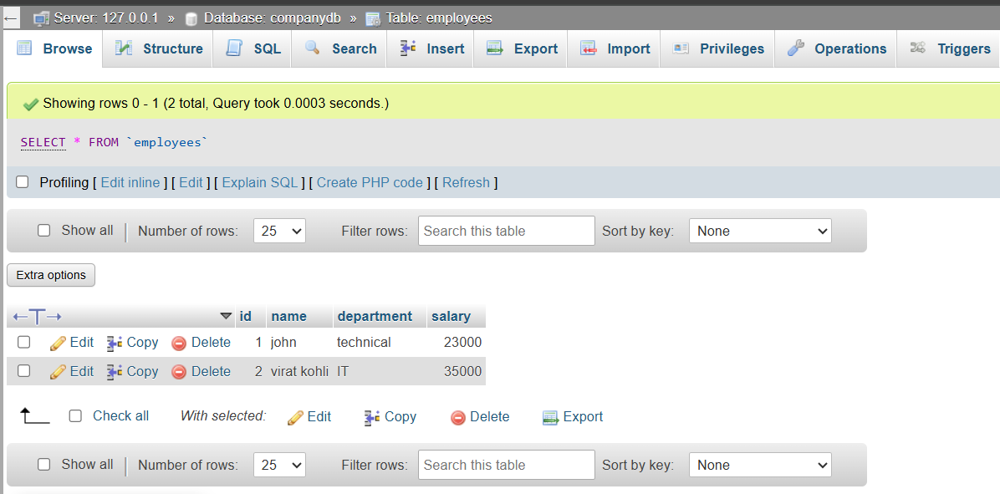

# Employee Database App (Java JDBC)

A simple console-based **Employee Database Application** built using **Java JDBC** to demonstrate CRUD operations (Create, Read, Update, Delete) with a MySQL database.

---

## **Objective**

- Learn how to connect a Java application to a MySQL database using JDBC.
- Perform **CRUD operations** using `Connection`, `PreparedStatement`, and `ResultSet`.
- Practice running Java apps with external libraries (MySQL Connector/J).


---

## **Technologies Used**

- Java (JDK)
- JDBC API
- MySQL Database (XAMPP)
- MySQL Connector/J (.jar)

---

## **How to Run**

1. **Start MySQL (XAMPP)**  
   Make sure your MySQL server is running and you have a database named `companydb` with an `employees` table:
   ```sql
   CREATE DATABASE companydb;
   USE companydb;
   CREATE TABLE employees (
       id INT AUTO_INCREMENT PRIMARY KEY,
       name VARCHAR(100),
       department VARCHAR(100),
       salary DOUBLE
   );
   ```
2. **Compile the Java file**
    ```bash
    javac -cp ".;lib/mysql-connector-j-9.3.0.jar" EmployeeDBApp.java
    ```
3. **Run the application**
    ```bash
    java -cp ".;lib/mysql-connector-j-9.3.0.jar" EmployeeDBApp
    ```

---

## **Features**
- Add Employee – Insert new employee records.
- View Employees – Display all employee records.
- Update Employee – Modify existing employee data by ID.
- Delete Employee – Remove employee data by ID.
- Uses PreparedStatement to prevent SQL injection.
- Demonstrates robust DB connection handling.

---

## **Sample Output**

```bash
Connected to database.

--- Employee Database Menu ---
1. Add Employee
2. View Employees
3. Update Employee
4. Delete Employee
5. Exit
Enter choice: 1
Enter name: john
Enter department: technical
Enter salary: 23000
Employee added successfully.

# (More CRUD operations...)
```

---

## **📸 Screenshots**



